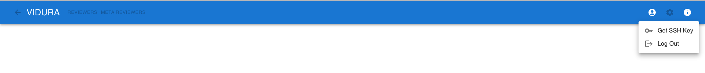

There are a list of pre-fetched DBLP in the database. The scripts are used to fetch missing DBLP urls, and upload the results to VIDURA. The results will be appended to the database, and will not affect the existing records.

DBLP website implements rate limiting. When the limit exceeds, the current progress are written to a `json` file. To continue, wait a few minutes, pass the `json` file to the script to run again, and run the script again. 

#### Setup
The script requires Python3 and ssh. 

1. The SSH key can be downloaded from the VIDURA web app after authentication. Click on the  icon in the app bar, then click  in the dropdown menu.


2. Install all required python packages
    ```bash
    pip install -r requirements
    ```

3. Create a `.env` file under the same directory as `main.py`. The variables include:
    - `OUT_DIR`: Required when `RESUME` is not provided. The directory to find all output files.
    - `IN_DIR`: Required when `RESUME` is not provided. A `.txt` file containing all DBLP urls to crawl.
    - `SIMILARITY_THRESHOLD`: Optional (default 0.6). The script uses sentence embeddings to obtain the areas of expertise from a DBLP page with all the publication titles. This variable specifies the minimum cosine similarity of the matches.
    - `TOPICS`: Optional. A `.txt` file with all areas of interest, each in a separate line. This is optional.
    - `RESUME`: Required when resuming after being rate limited. The `json` file contains the progress before rate limiting. The path is `OUT_DIR/resume.json`.  
    - `DB_IP`: Required. The IP address of the database.
    - `SSH_USER`: Required. The user name used for SSH connection.
    - `SSH_KEY`: Required. The private SSH key file downloaded from VIDURA. 

    An example of `.env`:
    ```bash
    OUT_DIR='/tmp/output'
    IN_DIR='/tmp/input.csv'
    DB_IP="ec2-xx-xx-xx-xx.ap-southeast-1.compute.amazonaws.com"
    SSH_USER="guest"
    SSH_KEY="/private_ssh_key"
    ```
#### Run
1. (This step can be ignored if the `TOPICS` argument is not provided) There is a list of existing areas of expertise in VIDURA, the new ones (if any) provided in the `TOPICS` input file will be appended to the list. To avoid duplications, run the following command to calculate the similarity between each new expertise and existing ones:
    ```bash
    ./similar_pairs.sh
    ```
    The possible duplicates will be written to `OUT_DIR/similar_pairs.csv`. Please review this file and manually edit the input file `TOPICS`. All new topics will be appended to the existing list in the following step.
2. To prepare all data locally:
    ```bash
    ./crawl.sh
    ```

3. When the data is ready, upload the results with:
    ```bash
    ./upload.sh
    ```
